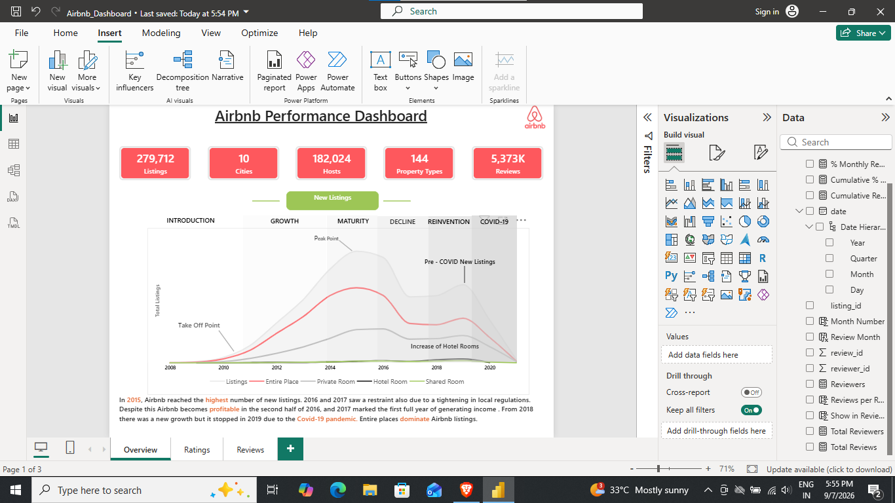
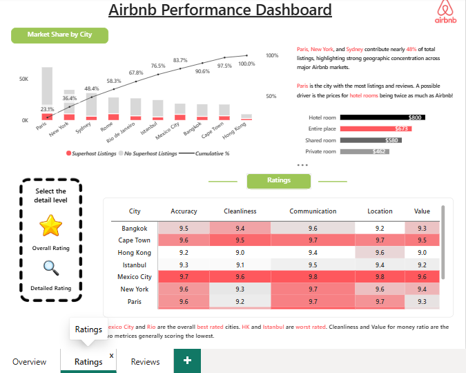
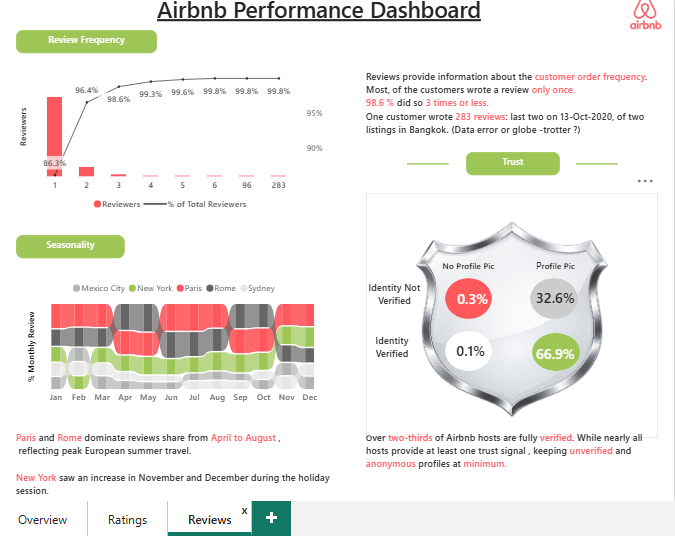

# 🏠 Airbnb Performance Dashboard

An interactive Power BI dashboard analyzing Airbnb's global performance across listings, hosts, ratings, and reviews — covering **279,712 listings**, **182,024 hosts**, and **5.37M reviews** across **10 major cities**.
---

## 👤 Author

** Sakshi Deshwal**
📧 sakshideshwal312@gmail.com

---

## 📊 Overview

This project explores Airbnb's growth trajectory, market concentration, guest satisfaction, and trust signals using a 3-page interactive Power BI report. It combines time-series trend analysis, geographic market share, host/city rating comparisons, and reviewer behavior patterns into a single, filterable dashboard.

---

## 🖼️ Screenshots

### Page 1 — Overview


### Page 2 — Ratings


### Page 3 — Reviews



---

## 📁 Dashboard Pages

### 1. Overview
- Key metrics: **279,712 listings**, **10 cities**, **182,024 hosts**, **144 property types**, **5,373K reviews**
- Listings growth trend segmented by lifecycle stage: *Introduction → Growth → Maturity → Decline → Reinvention → COVID-19*
- Breakdown by room type: Entire Place, Private Room, Hotel Room, Shared Room
- Key insight: Airbnb peaked in new listings in 2015, turned profitable in late 2016, and growth was interrupted in 2019 by COVID-19. **Entire place** listings dominate the market.

### 2. Ratings
- **Market share by city**: Paris, New York, and Sydney account for ~48% of total listings
- Average nightly price comparison by room type (Hotel Room ~$800 vs. Entire Place ~$673)
- City-level ratings breakdown across **Accuracy, Cleanliness, Communication, Location, and Value**
- Key insight: Paris leads in listings and reviews (likely due to high hotel prices); **Mexico City & Rio de Janeiro** are top-rated, while **Hong Kong & Istanbul** rate lowest — Cleanliness and Value are the weakest metrics overall.

### 3. Reviews
- **Review frequency**: 86.3% of reviewers left only one review; 98.6% reviewed 3 times or fewer (with one outlier of 283 reviews flagged as a possible data anomaly)
- **Seasonality**: Monthly review share by city, showing Paris and Rome peaking April–August, and New York spiking in Nov/Dec
- **Trust indicators**: Host verification breakdown by profile picture and identity verification status
- Key insight: Over **two-thirds of hosts are fully verified**, with unverified/anonymous profiles kept to a minimum (~0.3%).

---

## 🛠️ Tools & Tech Stack
- **Power BI Desktop** — data modeling, DAX measures, and report design
- **Power Query** — data cleaning and transformation
- Custom visuals: Decomposition Tree, KPI cards, area/line charts, cumulative % charts, radial/shield charts

---

## 🗂️ Data Model
Key fields used:
- `date` (with Year/Quarter/Month/Day hierarchy)
- `listing_id`, `review_id`, `reviewer_id`
- Measures: Total Reviews, Total Reviewers, Reviews per Reviewer, % Monthly Reviews, Cumulative %

---

## 🔑 Key Insights
- Entire-place listings dominate Airbnb's global inventory
- Top 3 cities account for nearly half of all listings — high market concentration
- Guest trust is high: majority of hosts are identity-verified
- Review behavior is mostly one-time, with seasonal spikes tied to regional travel patterns
- Growth was disrupted by tightening regulations (2016–17) and COVID-19 (2019 onward)

---

## 🚀 How to Use
1. Clone this repository or download the `.pbix` file
   ```bash
   git clone https://github.com/your-username/airbnb-performance-dashboard.git
   ```
2. Open the `.pbix` file in **Power BI Desktop**
3. Use the page navigation buttons (Overview / Ratings / Reviews) to explore
4. Interact with visuals — click bars, cities, or categories to cross-filter the dashboard

---

## 📂 Repository Structure
```
airbnb-performance-dashboard/
│
├── Airbnb_Dashboard.pbix        # Main Power BI file
├── README.md                    # Project documentation
└── assets/
    ├── overview.png
    ├── ratings.png
    └── reviews.png
```

---

## 📌 Future Improvements
- Add host-level revenue estimates
- Investigate the 283-review outlier for data quality
- Expand city coverage beyond the current 10 markets
- Add year-over-year comparison filters

---

## 📄 License
This project is open-sourced under the [MIT License](LICENSE).

---

⭐ If you found this project useful, consider giving it a star on GitHub!
